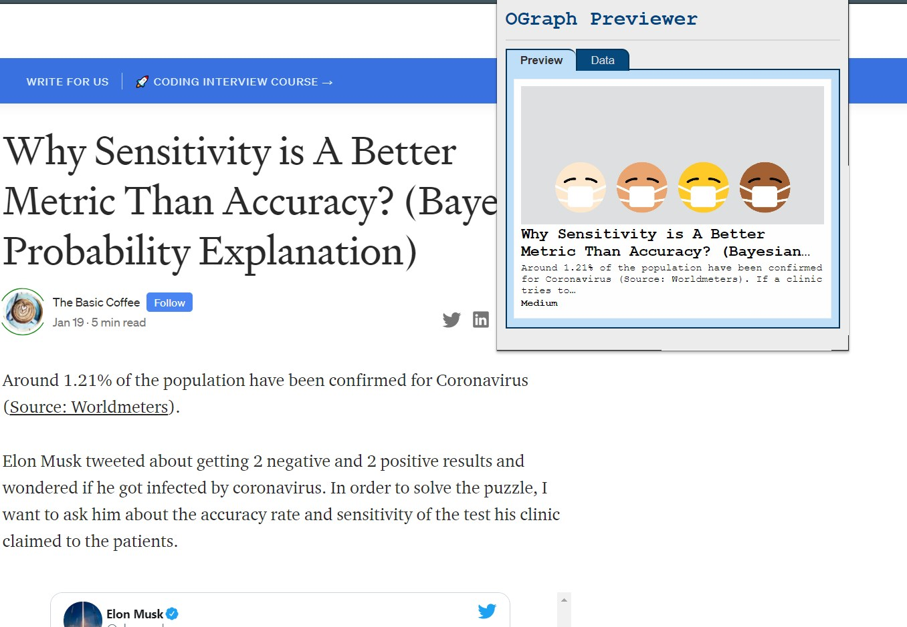
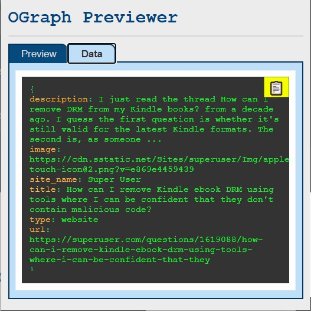
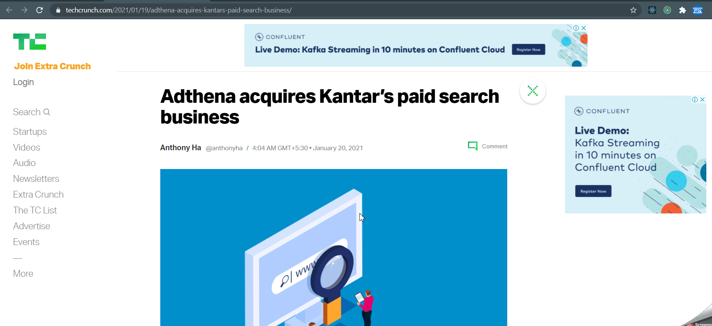

<h2 align="center">

&nbsp;OGraph Previewer

<a href="https://chrome.google.com/webstore/detail/ograph-previewer/ggcfeakcnodgcmmllfdbmngekljbhiim" target="_blank">
    
     
    
</a>

 

</h2>

A chrome extension to quickly preview open graph meta tag data of any web page in the current tab and retrieve it in a JSON format.

---

### Features:

- Display a visual `:og` data preview of the page in the current tab.
  

 

- Copy Data in JSON format with just a click of a button
  

### Extension In Action:

### Tech Stack & Tools:

- JavaScript (ESNext)
- Webpack
- Babel
- CSS
- HTML
- Jest

### Build Steps:

1. clone this repo.
2. `cd` into the cloned directory.
3. run `npm install`
4. run `npm run build`
5. The output directory named `dist` will be generated with production ready bundle.
